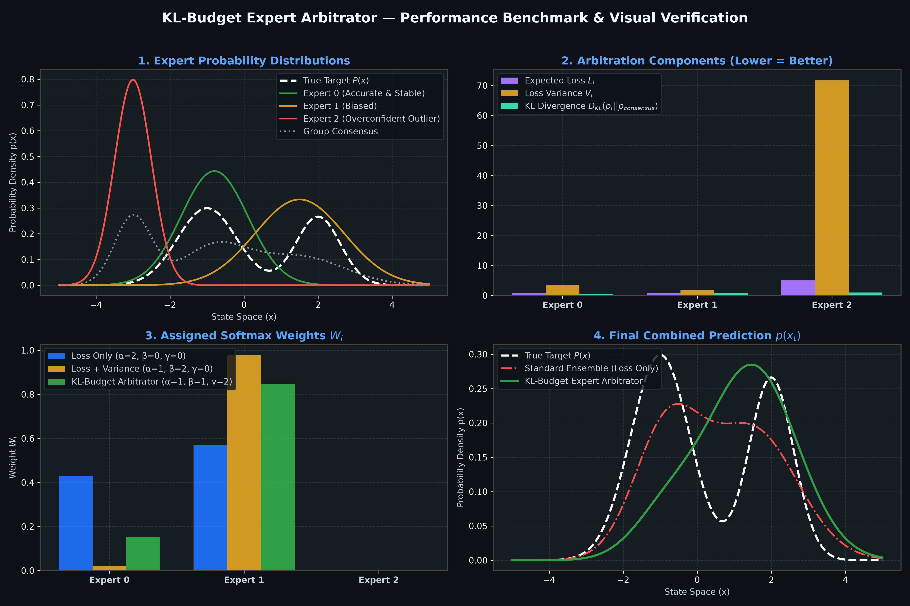

# KL-Budget Expert Arbitrator 
[](https://www.python.org/downloads/)
[](https://opensource.org/licenses/MIT)
[]()
[]()
> Dynamic expert weight arbitration using Softmax over **Loss**, **Loss Variance**, and **Kullback-Leibler (KL) Divergence Consensus**.
---
## 📌 Overview
**KL-Budget Expert Arbitrator** is a probabilistic ensemble framework designed for dynamic expert aggregation in Machine Learning and Decision Theory.
Traditional ensemble mechanisms (such as simple averaging or fixed stacking) assign weights based purely on historical accuracy. However, this leaves ensembles vulnerable to **overconfident outliers**, **volatile model performance**, and **hallucinations**. 
This framework solves this by dynamically calculating expert weights using a 3-factor Softmax objective:
1. **Expected Loss ($L_i$)**: Rewards experts with lower prediction error.
2. **Loss Variance ($V_i$)**: Penalizes volatile experts to prioritize consistency and risk management.
3. **Consensus Agreement ($A_i$)**: Penalizes experts whose probability distributions diverge significantly from the group consensus via **Kullback-Leibler (KL) Divergence**.
---
## 🧮 Mathematical Formulation
### 1. Expected Loss ($L_i$)
The expected loss for expert $i$ combines base prediction error and log-loss under parameter $p \in [0, 1]$:
$$L_i(c) = (1 - p) \cdot L_i(c) + p \cdot (-\log p_i(x_t))$$
### 2. Loss Variance ($V_i$)
To measure expert volatility and risk, the variance of the loss is computed as:
$$V_i(c) = (1 - p) \cdot L_i(c) + p \cdot \left(-\log p_i(x_t) - L_i(c)\right)^2$$
### 3. Consensus Agreement ($A_i$)
Agreement is defined as the negative Kullback-Leibler (KL) divergence of expert $i$'s probability distribution $p_i$ relative to the group consensus distribution $p_{\text{consensus}}$:
$$A_i(c) = -D_{\text{KL}}\left(p_i \parallel p_{\text{consensus}}\right)$$
### 4. Softmax Expert Weighting ($W_i$)
Dynamic weights are calculated by scaling the three components with hyperparameters $\alpha, \beta, \gamma$:
$$W_i(c) = \frac{\exp\left(-\alpha L_i(c) - \beta V_i(c) + \gamma A_i(c)\right)}{\sum_j \exp\left(-\alpha L_j(c) - \beta V_j(c) + \gamma A_j(c)\right)}$$
Where:
- $\alpha$: Weight for **Loss Minimization** (Accuracy)
- $\beta$: Weight for **Variance Penalty** (Stability & Risk Control)
- $\gamma$: Weight for **Group Consensus** (Outlier / Overconfidence Mitigation)
### 5. Final Combined Prediction
$$p(x_t) = \sum_i W_i(c) \cdot p_i(x_t)$$
---
## 📊 Visual Demonstration
Below is the simulation result generated by `kl_budget_arbitrator.py`:

### Key Insights from the Simulation:
* **Outlier Mitigation**: Expert 2 (overconfident outlier) is heavily penalized by $D_{\text{KL}}(p_2 \parallel p_{\text{consensus}})$, preventing it from distorting the combined prediction.
* **Risk-Aware Ensembling**: By tuning $\beta$ and $\gamma$, the ensemble prioritizes stable, consensus-aligned models over volatile ones.
---
## 🚀 Quickstart
### Prerequisites
- Python 3.8+
- `numpy`, `scipy`, `matplotlib`
### Installation
```bash
git clone https://github.com/YOUR_USERNAME/kl-budget-expert-arbitrator.git
cd kl-budget-expert-arbitrator
pip install -r requirements.txt
```
### Running the Demonstration
```bash
python kl_budget_arbitrator.py
```
---
## 🛠️ Usage Example in Python
```python
import numpy as np
from scipy.special import softmax
def compute_kl_expert_weights(L_i, V_i, A_i, alpha=1.0, beta=1.0, gamma=2.0):
    """
    Computes dynamic Softmax weights for an ensemble of experts.
    
    Parameters:
        L_i (array): Expected losses per expert.
        V_i (array): Loss variances per expert.
        A_i (array): Consensus agreement (-KL divergence) per expert.
        alpha (float): Accuracy weight.
        beta (float): Risk/Variance penalty weight.
        gamma (float): Consensus alignment weight.
    """
    logits = -alpha * L_i - beta * V_i + gamma * A_i
    return softmax(logits)
# Example: 3 Experts
losses = np.array([0.15, 0.45, 0.80])
variances = np.array([0.02, 0.10, 0.35])
agreements = np.array([-0.05, -0.20, -1.80]) # -KL divergence
weights = compute_kl_expert_weights(losses, variances, agreements, alpha=1.0, beta=1.0, gamma=2.0)
print("Assigned Expert Weights:", weights)
```
---
## 🤝 Use Cases & Applications
- **Multi-LLM / Mixture-of-Experts (MoE) Routing**: Dynamically weighting response distributions from different LLMs.
- **Financial Time Series Forecasting**: Risk-adjusted model blending (penalizing high variance models).
- **Autonomous Systems**: Sensor fusion & consensus arbitration in safety-critical robotics.
---
## 📜 License
Distributed under the MIT License. See `LICENSE` for more information.
